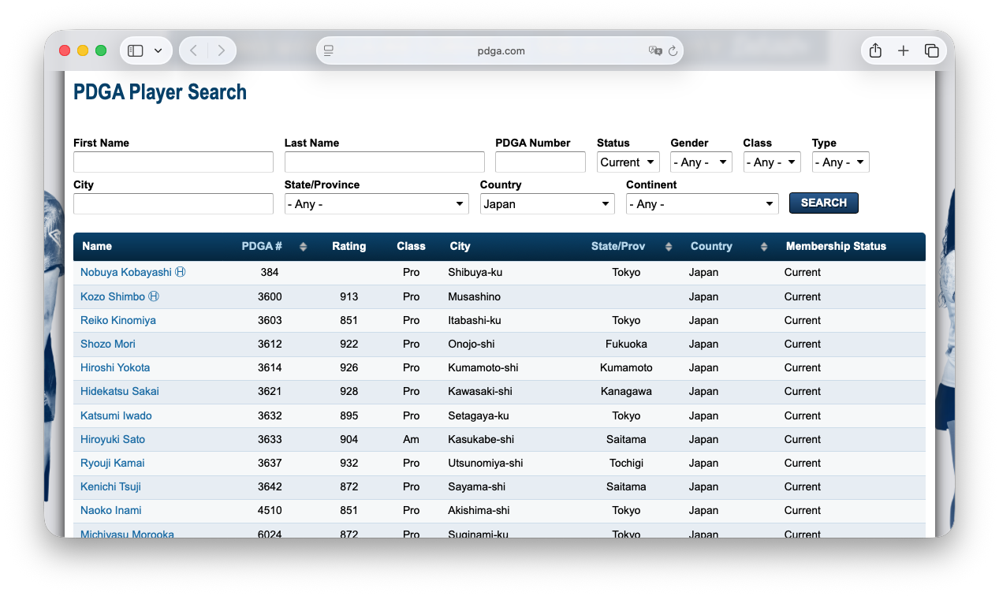
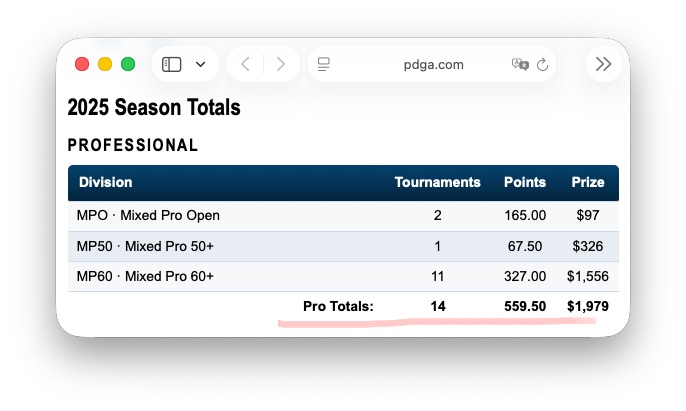
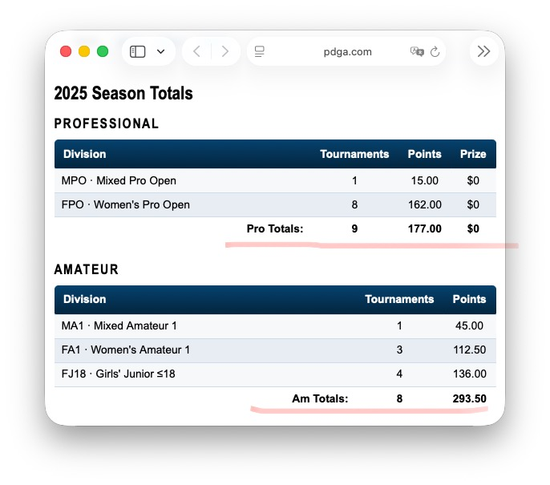

# PDGAに`Country=JP` として登録された `Current` 選手一覧をスクレイピングするツールを作成する

## 目的

[PDGA公式サイトのプレーヤー検索結果](`https://www.pdga.com/players)から、 **日本（`Country=JP`）に該当する有効会員（`Status=Current`）** の選手一覧を収集し、後続処理（各選手ページから Total points / Total prize を取得）に使える 基礎プロフィールデータを作成する。

## 入力

* [`PDGA Player Search`](https://www.pdga.com/players) 結果ページ（ページネーションあり）から有効なデータを取得する。
* PDGA Player Search クエリ:
    * `https://www.pdga.com/players?Status=Current&Country=JP&page=N`
* page=0 から開始し、次ページが無くなるまで自動で巡回すること



## 出力（JSON）

* ファイル `players.json` を生成する
* フォーマットは次の構造とする:
    ```json
    {
      "generatedAt": "ISO8601",
      "source": {
        "baseUrl": "https://www.pdga.com/players",
        "query": {
          "Status": "Current",
          "Country": "JP"
        }
      },
      "count": 123,
      "players": [
        {
          "pdgaNumber": 6075,
          "name": "First Last",
          "class": "Pro"|"Am",
          "rating": 000
        }
      ]
    }
    ```
* `pdgaNumber`は、`PDGA#`列から
* `name`は、`Name`列から
* `class`は、`Class`列から
* `rating` は、空なら null とする。

## ページネーション仕様（要件）
* page=0,1,2,3... を順に取得
* 終了条件は以下のいずれか（複数で冗長化して良い）
  1.	次ページリンク（Next）が存在しない
  2.	テーブルの行数が 0
  3.	直前ページと同じPDGA#しか出てこなくなった（保険）

## 重複排除
* 全ページを跨いで pdgaNumber で重複排除する
* 最終出力 players は pdgaNumber 昇順でソート（安定化のため）

## 技術要件（Node.js）
* Node.js 22+（fetch が使える前提）
* DOM解析は [cheerio](https://cheerio.js.org) を使用
* 依存関係は package.json で管理し、npm i で再現可能にする

## 実装要件（堅牢性）
* HTML構造変更にできるだけ耐えるため、テーブル検出は次のいずれかで実装する
* テーブルヘッダに "Name" と "PDGA #" が含まれるテーブルを探す
* もしくは行から `href="/player/<digits>"` を含むリンクを抽出し、PDGA# をパースする
* HTTPエラー（429/5xx等）はリトライ（最大3回、指数バックオフ）を実装する
* サイト負荷軽減として、ページ取得間に **delay（例：1000ms以上）**を入れる
* User-Agent を付ける

## 実行方法（CLI仕様）
* コマンド形式:
    * `node scrape_players.js` または|かつ `npm start`
        * 実行後、`players.json` がカレントに生成される

## ログ要件
*	進捗を stderr に出す（例）
  *	page=2 rows=25 totalUnique=48
* 最終的に
	* 取得総数、ユニーク数、出力先ファイル
を表示

## ディレクトリ構成（推奨）
```
pdga-scraper/
  package.json
  scrape_players.js
  players.json   (生成物)
  README.md      (簡単な使い方)
```
## 受け入れ基準（Definition of Done）
*	スクリプト実行で `players.json` が生成される
* JSONの players[] に `pdgaNumber/name/class` が全件入っている
* ページネーションで複数ページを辿れる
* 同じ選手が重複して出力されない
* 実行ログで進捗が確認できる

---

# 各選手のPDGAプロフィールから指定年の`Season Totals`を取得する

## 目的

- 指定された選手リスト(`players.json`)から、
個々の選手のプロフィールの指定された西暦の結果をを検索し、
指定された西暦の総ポイントと賞金額(プロ部門のみ)を追加する。

## 入力
- 入力ファイル: `players.json`をCLI引数で指定する。
    - データ形式は、先に作成した`scrape_players.js`の仕様を参照すること。
- 検索の対象年(西暦)をCLI引数で指定する。
- 個々の選手の対象年の成績を`pdgaNumber`と対象年からなるクエリ(`https://www.pdga.com/player/[pdgaNumber]/stats/[対象年]`)を生成しアクセスする。

## 出力
- 入力ファイルは上書きせずに新たに作成した`players_[対象年]_with_totals.json`に保存する。
- `players` 配列内の各要素に `points`（数値または null）、`prize`（数値または null, 単位 USD を想定、プロのみ）を追加する。
- 既存フィールドは保持し、`pdgaNumber` 昇順は維持。
- ただし、有効な`points`および`prize`のどちらも持たない選手は、当該年に活動が無かったとして、出力から除外する（`count` は除外後の件数）。

## 抽出対象
- 対象年のプロフィール成績ページ: `https://www.pdga.com/player/[pdgaNumber]/stats/[対象年]` を取得する（例: `https://www.pdga.com/player/6075/stats/2025`）。
- ページ内の「Season Totals」見出しが「`<年> Season Totals`」となっていることを確認し、<年>が対象年と一致する場合のみ採用する（不一致や未表示なら `points` / `prize` は null）。
- 選手の`Class`が`Pro`の時:
    - 見出し直下の表を対象とし、`Pro Totals:` 行を探して `Points` 列と `Prize` 列の値を取得し当該選手の`points`と`prize`とする。
- 選手の`Class`が`Am`の時:
    - 見出し直下の表の`PROFESSIONAL`を対象とし、`Pro Totals:` 行を探して `Points` 列の値を取得する。`Prize`は無視すること。ただし当該選手がプロ部門での活動実績がない時は、この表は表示されないので注意すること。
    - 次に`AMATEUR`の見出し直下の表から、`Am Totals`行を探して、`Points`列の値を取得する。
    - `Pro Totals`と`Am Totals`の値の合算ポイントを当該選手の`points`とする。
    - `prize`は常に`null`とすること。
- 列名のマッチは大小文字を無視し、コロン有無や余分な空白を許容する。
- 値はカンマや `$` を除去して数値化（数値化できなければ null）。



## ページ検出・フォールバック
- 「`<年> Season Totals`」見出しは h2/h3 テキスト一致や、`id`/`name` 属性に `season-totals` 等が含まれる場合を含めて検出し、見出しテキスト内に指定年が含まれるかを確認する。
- 見出し直後の最初の表を優先し、複数表がある場合はヘッダに `Points` / `Prize` / `Division` 等が含まれるものを選ぶ。
- `Pro Totals` 行や`Am Totals`が見つからない場合は `points` / `prize` を null とする。

## HTTP 取得
- `https://www.pdga.com/player/[pdgaNumber]/stats/[対象年]` へ GET する。全員分を直列または軽い並列（例: 同時 2-3 件）で実行し、サイト負荷を抑える。
- User-Agent を付与。
- 各リクエスト間に delay（例: 800–1500ms の可変設定）を入れる。
- HTTP 429/5xx は指数バックオフで最大 3 回リトライ。
- 4xx など非リトライの場合はその選手はスキップし、`points` / `prize` を null として続行。

## ログ
- 標準エラーに進捗を出力する
    - 例: `player=12345 year=2025 fetch=ok points=12 prize=345.67`
    - 例: `player=12345 year=2025 filtered-out (points/prize both null)`
    - エラー時も `player=PDGA# error=...` と出し、処理は継続。
- 終了時処理結果を出力する
    - 例: `filtered=3 kept=82`

## CLI 仕様（例）
- `node add_totals.js players.json players_2025_with_totals.json 2025`

## 出力整形
- JSON はインデント 2 で保存。

## 受け入れ基準
- スクリプト実行で出力 JSON が生成され、`players` には `points` / `prize` が両方 null の選手を除外した結果が入っていること（除外件数はログに出る）。
- 出力された全選手に `points` / `prize` キーがあること（アマ登録選手の `prize` は null で可）。
- 指定年と一致する「`<年> Season Totals`」セクションがある選手では、Points / Prize が数値として取得されること。
- 出力に残った選手について、pdgaNumber, name 等の既存フィールドが保持されていること。
- エラーがあっても全体が途中で停止せず、ログで確認できる。***

---

# プロ/アマ別のランキング表の作成

## 目的

前段で作成した `points`および`prize`を伴った成績表からプロアマ別のランキング表を作成する。

## 入力ファイル

- 前段で作成した `points`および`prize`を伴った成績表(e.g. `players_2025_with_totals.json`)を指定

## ランキング表の種別と出力ファイル

以下の3種類のランキング表を作成する。
なお対象年は、入力ファイル名から抽出すること。

- プロ部門: `points`順ランキング表および`prize`順ランキング表の2種
    1. `ranking_[対象年]_pro_points.txt`
        - Class=Proの選手を抽出し、`points`で降順にソートして、順位 名前 `points`を出力する。
        - `points`が`null`または`0`の時、当該選手は出力から除外すること
    1. `ranking_[対象年]_pro_prize.txt`
        - Class=Proの選手を抽出し、`prize`で降順にソートして、順位 名前 `prize`を出力する。
        - `prize`が`null`または`0`の時、当該選手は出力から除外すること
- アマ部門: `points`順ランキング表の1種
    1. `ranking_[対象年]_am_points.txt`
        - Class=Amの選手を抽出し、`points`で降順にソートして、順位 名前 `points`を出力する。
        - `points`が`null`または`0`の時、当該選手は出力から除外すること

## 出力データ形式

- テキストファイル
- 一行に一選手
- 順位を昇順にソート(1位が先頭になること)
- '順位 名前 [points|prize]'の通り各項目をスペースで区切って最後に改行文字をつけた形式で出力

## CLI形式

- `node ranking.js [inputfile]`
    - e.g. `ranking players_2025_with_totals.json`
    - 上記例の場合以下のファイルが作成される:
      1. `ranking_2025_pro_points.txt`
      1. `ranking_2025_pro_prize.txt`
      1. `ranking_2025_am_points.txt`
